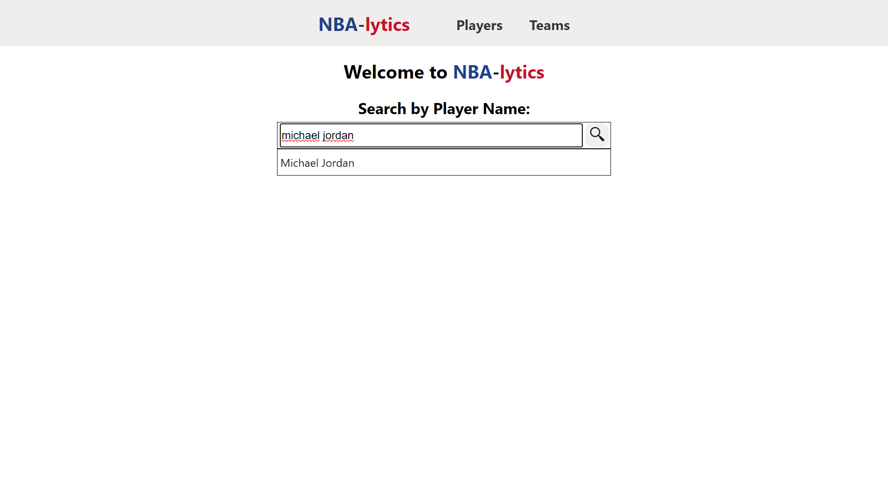
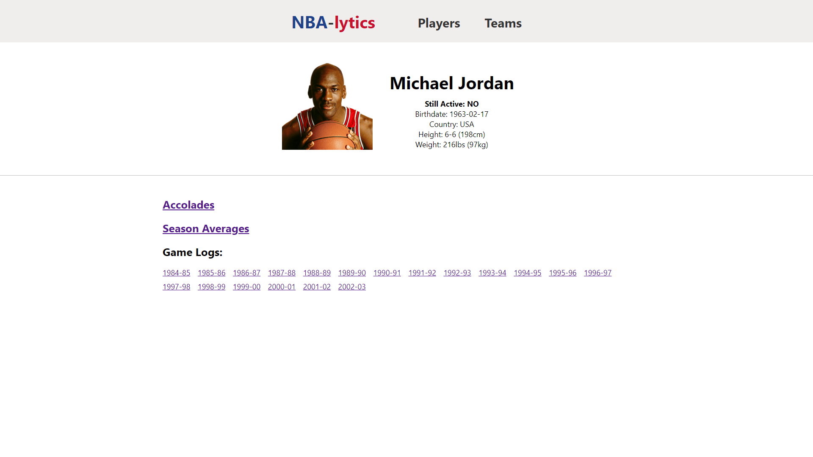
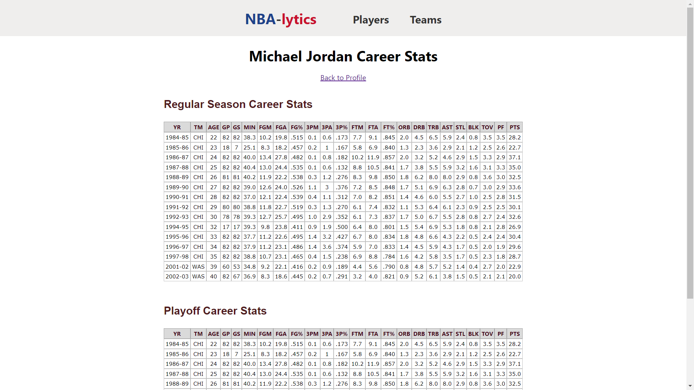

# 🏀 NBA-lytics 🏀

**NBA-lytics** is a comprehensive tool for Basketball enthusiasts to access player and team profiles, 
statistics, accolades and game logs. It also provides a convenient script for downloading player headshots.

## Screenshots

## 📌 Set up
#### Backup Setup
1. Clone the repository: `git clone git@github.com:Eric13531/NBA-lytics.git`
2. Navigate to the backend directory: `cd nba_app_backend`
3. Run `python -m venv venv` to create a Python virtual environment
4. Run `source venv/bin/activate` on macOS and Linux, and `venv\Scripts\activate` on Windows to activate the virtual environment
6. Install dependencies: `pip install -r requirements`
7. Run `./manage.py runserver`
#### Frontend Setup
1. Navigate to the frontend directory: `cd nba_app_frontend`
2. Install dependencies: `npm install`
3. Run `npm start` to start the React development server

The application should now be running on http://localhost:3000.

##### Download Player Headshots
1. Navigate to the backend directory: `cd nba_app_backend`
2. Run `python` to launch the Python interpreter
3. Import the `pictures.py` module: `from nba_app_backend.scripts.pictures import picture`
4. Use the `get_picture_from_id` function to retrieve a player headshot: `picture.get_picture_from_id(player_id, dir_path, file_name=None)`
5. Use the `get_all_player_pictures` function to retrieve headshots for all players: `picture.get_all_player_pictures(dir_path)`
